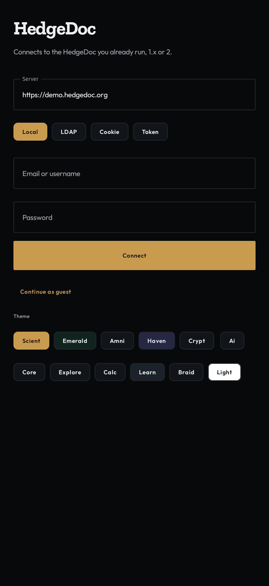
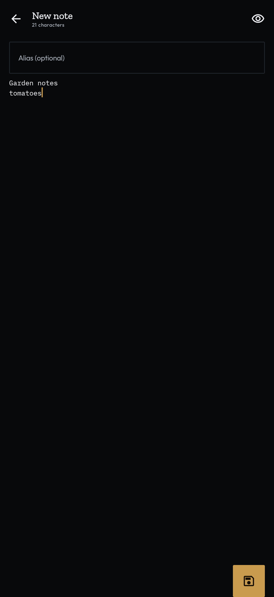

# HedgeDoc for Android

Unofficial native Kotlin client for [HedgeDoc](https://hedgedoc.org) 1.x and 2. HedgeDoc itself is AGPL, so this app is too. The HedgeDoc logo is under separate terms and is **not** used here.

<p>


</p>

Connect to a server you host, or `https://demo.hedgedoc.org`. The app asks `/api/private/config` whether the instance is HedgeDoc 2. 1.x keeps the old REST + Socket.IO path. 2 uses `/api/private` (session + CSRF) and `/api/v2` (bearer token).

## Install

[Download the latest APK](https://github.com/Amnibro/hedgedoc-android/releases/latest), or the same links from [amni-scient.com/amni-hedgedoc](https://amni-scient.com/amni-hedgedoc.html).

- **signed** — installable sideload. Signed with the Android debug certificate, so Play Protect may warn. Package `org.hedgedoc.android`. Every release uses the same certificate, so `-r` upgrades in place.
- **unsigned** — same release build, no signature. Sign it with your own key if you want.

Each release carries both a versioned name and an unversioned one. The unversioned name always points at the newest release:

```
curl -LO https://github.com/Amnibro/hedgedoc-android/releases/latest/download/hedgedoc-android-signed.apk
adb install -r hedgedoc-android-signed.apk
```

Min Android 8.0 (API 26).

## Features

- Email/username, LDAP, guest, browser session cookie, or HedgeDoc 2 API token
- History with search, pinned filter, plant-label cards
- Markdown reader (tables, tasks, images) with tappable task checkboxes
- Native live view on HedgeDoc 1.x: the reader and the editor follow other people's edits over the
  Socket.IO document, no WebView involved
- Native editor with preview and optional alias on create
- Autosave. Typing writes itself 1.2s after you stop, and leaving the editor flushes the rest
- HedgeDoc 2: create/update/delete over REST, reader re-reads on a timer
- Live editor (WebView with your session cookie; `/n/…` on HedgeDoc 2) for the full web UI
- Pin, remove from history, delete note
- Share link, markdown, or PDF (PDF is 1.x)
- Published link, revisions, permission (1.x: freely…private; 2: public/private)
- Offline cache of the last download
- Share text into the app as a new note
- Amni-Scient themes

Edits to a 1.x note go out as operations against the live document, transformed against anything a collaborator sent while yours was in flight, so two people can type in the same note. HedgeDoc 2 has no realtime protocol this app can speak, so a 2 note is written whole and read back on a timer.

## Build

```
./gradlew.bat assembleDebug assembleRelease
```

- Debug (already signed, `.debug` package): `app/build/outputs/apk/debug/app-debug.apk`
- Release unsigned: `app/build/outputs/apk/release/app-release-unsigned.apk`

Java 17 comes from Android Studio's JBR (`gradle.properties`).

## License

[AGPL-3.0-or-later](LICENSE). Fonts: Zilla Slab, Outfit, IBM Plex Mono under the SIL Open Font License.
